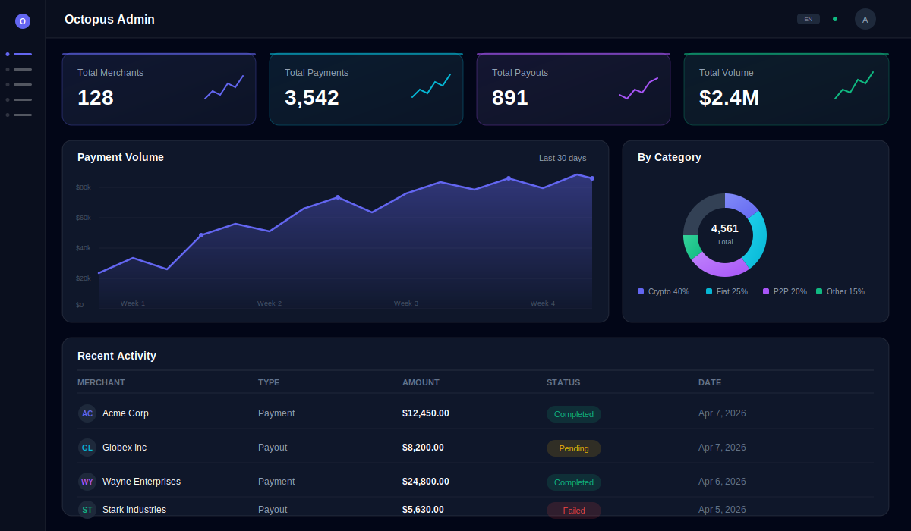
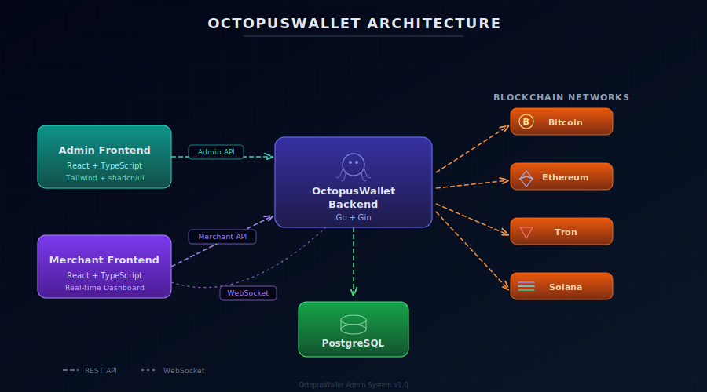
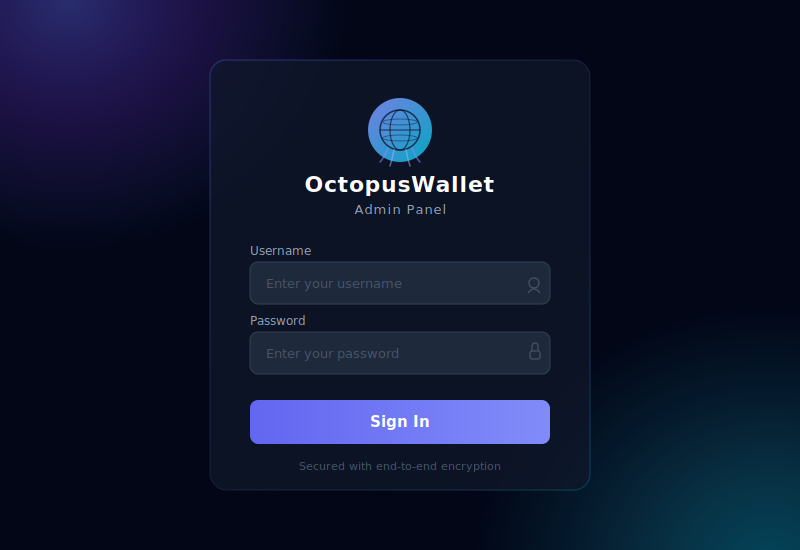

# OctopusWallet Admin

> A modern, open-source admin dashboard for [OctopusWallet](https://github.com/gopvra/OctopusWallet) — a multi-chain cryptocurrency payment gateway.

<p align="center">
  
</p>

## Features

- **Dashboard** — Real-time statistics, payment volume charts, chain distribution, recent activity
- **Merchant Management** — List, search, activate/deactivate merchants
- **Payment Monitoring** — Filter by status, chain, merchant with full detail views
- **Payout Tracking** — Monitor outgoing payouts with status tracking
- **Refund Management** — Track refund requests and their processing status
- **Batch Payouts** — View batch payout operations with per-item detail
- **Wallet Overview** — Browse all HD-derived wallet addresses
- **Balance Ledger** — Monitor merchant available/pending balances per chain
- **Supported Currencies** — View all configured currencies and tokens
- **Chain Status** — Monitor blockchain sync state per chain
- **Admin Users** — Manage admin accounts with role-based access (super_admin)
- **Dark Sci-Fi Theme** — Professional dark UI with glassmorphism effects

## Architecture

<p align="center">
  
</p>

The admin system consists of two parts:

| Component | Repository | Tech Stack |
|-----------|-----------|------------|
| **Admin API** | [OctopusWallet](https://github.com/gopvra/OctopusWallet) | Go + Gin + JWT + PostgreSQL |
| **Admin Frontend** | This repo | React 18 + TypeScript + Vite + Tailwind CSS |

Both connect to the same PostgreSQL database. The admin API runs alongside the main OctopusWallet server.

## Tech Stack

| Layer | Technology |
|-------|-----------|
| Framework | React 18 + TypeScript |
| Build Tool | Vite |
| Styling | Tailwind CSS v4 |
| Data Fetching | TanStack Query |
| Tables | TanStack Table |
| Charts | Recharts |
| Routing | React Router v7 |
| State | Zustand |
| Icons | Lucide React |
| HTTP Client | Axios |

## Quick Start

### Prerequisites

- Node.js 18+
- OctopusWallet backend running (with admin API enabled)
- PostgreSQL with migrations applied

### Installation

```bash
git clone https://github.com/gopvra/OctopusWallet-Admin.git
cd OctopusWallet-Admin
npm install
```

### Development

```bash
npm run dev
```

The dev server starts at `http://localhost:5173` and proxies `/api` requests to `http://localhost:8080` (OctopusWallet backend).

### Build

```bash
npm run build
```

Output goes to `dist/` — serve with any static file server.

### Default Login

On first startup, OctopusWallet creates a default admin account:

```
Username: admin
Password: changeme
```

> **Important:** Change the default password immediately after first login.

## Backend Configuration

Add to your OctopusWallet `config.yaml`:

```yaml
admin:
  jwt_secret: "your-secure-random-secret-here"  # Required: change this!
  default_user: "admin"
  default_pass: "changeme"
  allowed_origins:
    - "http://localhost:5173"    # Vite dev server
    - "https://admin.yourdomain.com"
```

Or via environment variables:

```bash
export OCTOPUS_ADMIN_JWT_SECRET="your-secure-random-secret-here"
export OCTOPUS_ADMIN_DEFAULT_USER="admin"
export OCTOPUS_ADMIN_DEFAULT_PASS="your-strong-password"
```

## Admin API Endpoints

All endpoints are under `/api/admin/v1`:

### Authentication
| Method | Path | Description |
|--------|------|-------------|
| POST | `/auth/login` | Login with username/password |
| POST | `/auth/refresh` | Refresh JWT token |
| GET | `/auth/me` | Get current admin user |

### Dashboard
| Method | Path | Description |
|--------|------|-------------|
| GET | `/dashboard/stats` | Aggregate statistics |
| GET | `/dashboard/volume-chart` | Payment volume over time |
| GET | `/dashboard/chain-distribution` | Volume by chain |
| GET | `/dashboard/recent-activity` | Recent payments and payouts |

### Resources
| Method | Path | Description |
|--------|------|-------------|
| GET | `/merchants` | List merchants (paginated, searchable) |
| GET | `/merchants/:id` | Merchant detail |
| PUT | `/merchants/:id` | Update merchant |
| PATCH | `/merchants/:id/toggle-active` | Toggle merchant active status |
| GET | `/payments` | List payments (filterable) |
| GET | `/payments/:id` | Payment detail |
| GET | `/payouts` | List payouts (filterable) |
| GET | `/payouts/:id` | Payout detail |
| GET | `/refunds` | List refunds (filterable) |
| GET | `/refunds/:id` | Refund detail |
| GET | `/batch-payouts` | List batch payouts |
| GET | `/batch-payouts/:id` | Batch payout detail with items |
| GET | `/wallets` | List wallets (filterable) |
| GET | `/balances` | Merchant balances |
| GET | `/currencies` | Supported currencies |
| GET | `/chain-state` | Chain sync status |

### Admin Users (super_admin only)
| Method | Path | Description |
|--------|------|-------------|
| GET | `/admin-users` | List admin users |
| POST | `/admin-users` | Create admin user |
| PUT | `/admin-users/:id` | Update admin user |
| DELETE | `/admin-users/:id` | Delete admin user |

## Project Structure

```
src/
├── api/client.ts              # Axios instance with JWT interceptor
├── App.tsx                    # Routes + QueryClient
├── index.css                  # Tailwind + dark theme CSS variables
├── stores/auth-store.ts       # Zustand auth state
├── hooks/                     # TanStack Query hooks
│   ├── use-dashboard.ts
│   ├── use-merchants.ts
│   ├── use-payments.ts
│   ├── use-payouts.ts
│   ├── use-refunds.ts
│   ├── use-batch-payouts.ts
│   └── use-wallets.ts
├── components/
│   ├── layout/                # Sidebar, header, app layout
│   ├── data-table.tsx         # Reusable paginated table
│   ├── stat-card.tsx          # Dashboard stat card
│   ├── status-badge.tsx       # Status indicator
│   ├── chain-icon.tsx         # Chain badge/icon
│   └── address-display.tsx    # Address with copy button
├── pages/
│   ├── login.tsx
│   ├── dashboard.tsx
│   ├── merchants/             # list + detail
│   ├── payments/              # list + detail
│   ├── payouts/               # list + detail
│   ├── refunds/               # list + detail
│   ├── batch-payouts/         # list + detail
│   ├── wallets.tsx
│   ├── balances.tsx
│   ├── currencies.tsx
│   ├── chain-status.tsx
│   └── settings.tsx
└── types/index.ts             # TypeScript interfaces
```

## Login Page

<p align="center">
  
</p>

## Security

- JWT authentication with access/refresh token pair
- Refresh tokens validated with issuer check
- Login rate limiting (5 requests/minute)
- Timing-attack resistant login (constant-time password comparison)
- UUID validation on all ID parameters
- Security headers (X-Frame-Options, X-Content-Type-Options, CSP)
- CORS with explicit origin whitelist
- Admin self-deletion prevention
- Deactivated user token refresh rejection
- Content Security Policy meta tag

## License

MIT
